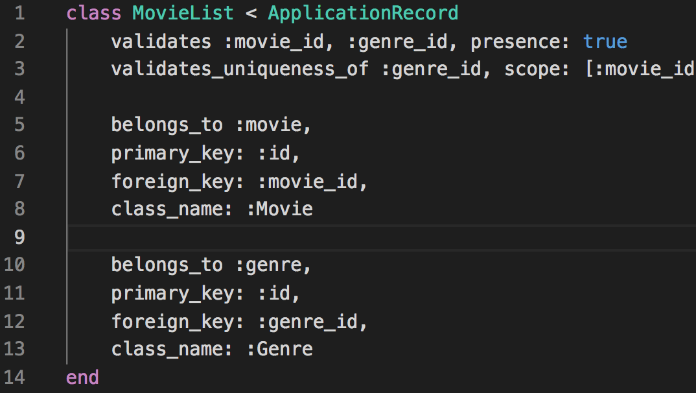
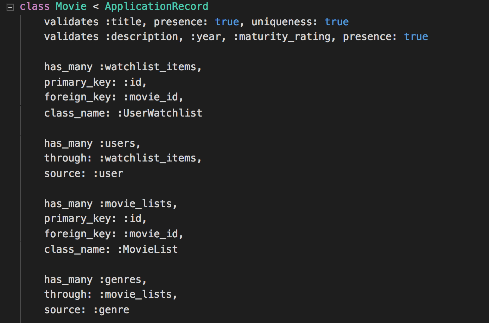
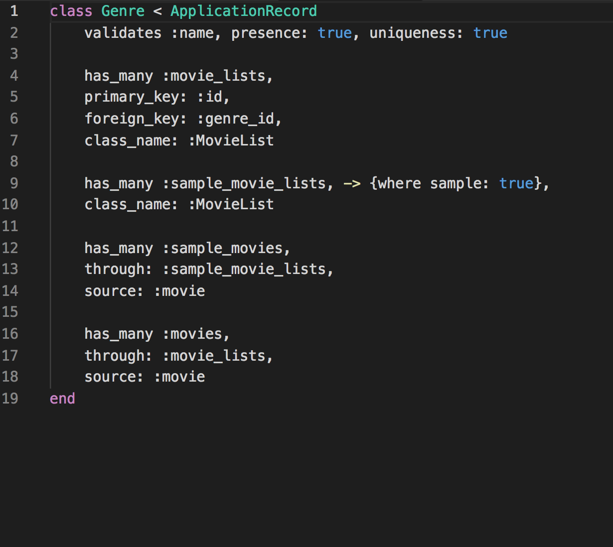
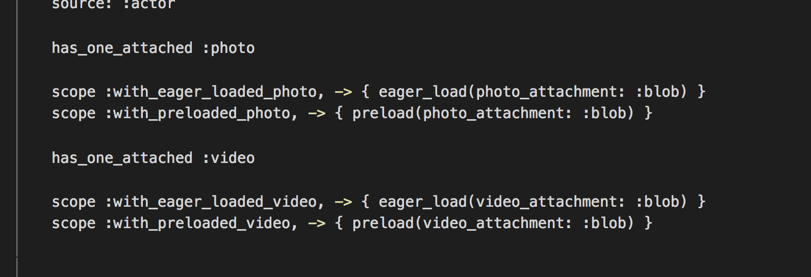
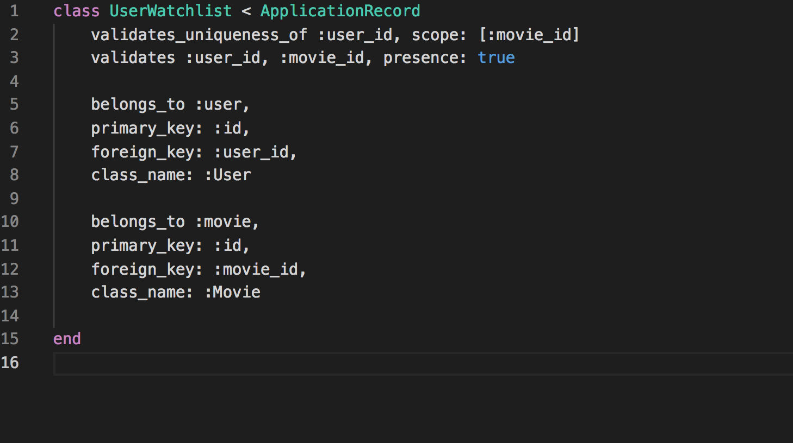

# RedFlix

Check out the live app [here](https://red-flex.herokuapp.com/#/).

Redflix is a single-page Netflix clone web-application, inspired by my love of Russian and Soviet cinema. It uses Rails and Postgres on the backend and React/Redux on the frontend.

This project was built in two weeks, although I plan to improve it further more and add more features.

# Features 

### Authentication

* Password digest using BCrypt.

* Session token refresh on every sign in and sign out.

### Watch movies 

* Users can watch movies 

* Users can watch movie trailers on the browse page

### Searching and Browsing movies 

* Users can browse movies by genres

* Users can search movies by titles 

### My List 

* User have their lists

* Users can add and remove movies to their list

# Technical solutions

###  Organizing data

* Movies and Genres are connected by movie-lists joins table.

* Acitve Records assosiations are establish to enable fetching all the movies belonging to the specific genre and all the genres belonging to the specific movie.

* Movie-lists table has sample-movie boolean column which is designed to avoid fetching every movie in the database when populating the main page with genres. 
.
* Active Storage is used to store movie posters and videos. Active Storage assosiactions are defined in a way to enable eager loading in the conrtollers. 
.
* My Lists is handled in a special way. It is set in the Genre table under index 0, only it gets its movies from user-watchlists joins table every time there is a need to extract 'my-list' for a given user (and not from the movie-lists). This solution was chosen to make it possible to deal with my-list on the frontend level as another genre.
. 
* Additionally actors and castings tables are established with according Acrtive Record assosiactions to add movie cast feature to movies (this part is realized only on the backend level due to the time constraints). 

### Routes and controllers 
* Following routes are established to manage MVC model. 
. 
* User and Session controllers take care of signing up, logging in and logging out the user.
* Genres controller is responsible for populating the browse page with movies. It uses INDEX method to get all the genres and sample movies that belong to that genre and SHOW method to get all the movies belonging the specific genre. Both methods use Active Records 'includes' and Active Storage 'with_attached' methods to enable eager loading and avoid n+1 db queries. 

* After fetching all the movies that belong to the specific genre SHOW method also gathers data on all the other genres that fetched movies also belong to, which lets sort movies of the given genre by other genres on the frontend level.
* SHOW and INDEX method also gather the user watchlist movies under the genre indexed at zero.
* Movies controller has CREATE and DELETE methods which add and remove movies from the user's watchlist, and SHOW method which is responsible for fetching the movie user is going to watch. 

### Redux state and logic 
* The state consists of the follwing slices. 

* Session slice handles user auth concerns. 
* Entities slice translates the db structure onto the FrontEnd level. 

* Errors slice handles delivering session errors to the user. 
* DropDownMovie slice handles logic nessecary to provide dropdown movie-window feature in the movie-list carousels. 

* MainMovie slice contains the main movie_id that is displayed on top of every browse page. 
* Search slice contains the search phrase provided by the user and is responsible for handling the logic of reorganizing the web-application structure when the user is searching for something. 

### Frontend routes and structure
* The app has the following main structure 

* Protected and Auth routes are utilized to control users access to the app's components. 
* MoviePlayContainer plays the movie according to the :moveId param in the frontend route. 

* GenreIndexContainer either renders the home page if the :genreId param is empty 

 or the specific genres if it's not. 
 

### Some of React components 
* The app heavily relies on React to create an engaging and interactive frontend. 
* The main components are broken down into smaller ones. Like GenreIndexContainer includes GenreIndexItems,  which in their turn include MovieListItems.

*  Those lists represent movies of the specific genre organized in a carousel style. 
.
* Background posters for each movie are extracted from Active Storage, passed down the props and used for styling directly from inside the React Component.
.

# Pages 
* Landing
.
* Sing up/Sing In
.
* Home
.
* Selected Genre 
.
* Search Results 
.
* My List
.

